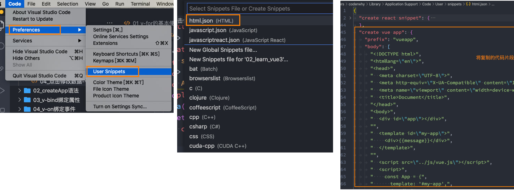
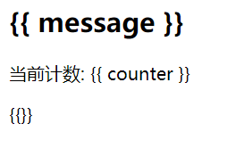

# 内容回顾

## 一. 邂逅Vue.js开发

### 1.1. Vue介绍

* Vue的介绍
* Vue在前端的地位
  * react
  * angular

* 直接学习Vue3


### 1.2. Vue下载和使用

* CDN引入
* 下载引入
* 初体验一下Vue开发


### 1.3. Vue的三个案例

#### 1.3.1. 动态数据展示


#### 1.3.2. 动态展示列表

* v-for


#### 1.3.3. 计数器案例

* counter
* increment
* decrement


### 1.4. 命令式和声明式编程的区别

* 原生实现计时器


### 1.5. MVC和MVVM的模型区别


### 1.6. options api的data详解

* data必须是一个函数, 函数会返回一个对象
* data返回的对象, 会被Vue进行劫持(放到响应式系统中), 所以data的数据发生改变时, 界面会重新渲染


### 1.7. options api的methods详解

* 对象 -> 很多函数
* 里面函数不能是箭头函数:
  * this


## 二. 基础 - 模板语法

### 2.1. 添加代码片段

* 第一步，复制自己需要生成代码片段的代码；

* 第二步，https://snippet-generator.app/在该网站中生成代码片段；

* 第三步，在VSCode中配置代码片段；

  

### 2.2. mustache语法(插值语法)

* 表达式

  ```html
  <html lang="en">
  <head>
    <meta charset="UTF-8">
    <meta http-equiv="X-UA-Compatible" content="IE=edge">
    <meta name="viewport" content="width=device-width, initial-scale=1.0">
    <title>Document</title>
  </head>
  <body>
  
    <div id="app">
      <!-- 1.基本使用 -->
      <h2>{{ message }}</h2>
      <h2>当前计数: {{ counter }} </h2>
  
      <!-- 2.表达式 -->
      <h2>计数双倍: {{ counter * 2 }}</h2>
      <h2>展示的信息: {{ info.split(" ") }}</h2>
  
      <!-- 3.三元运算符 -->
      <h2>{{ age >= 18? "成年人": "未成年人" }}</h2>
  
      <!-- 4.调用methods中函数 -->
      <h2>{{ formatDate(time) }}</h2>
  
      <!-- 5.注意: 这里不能定义语句 -->
      <!-- <h2>{{ const name = "why" }}</h2> -->
  
    </div>
    
    <script src="../lib/vue.js"></script>
    <script>
      // 1.创建app
      const app = Vue.createApp({
        // data: option api
        data: function() {
          return {
            message: "Hello Vue",
            counter: 100,
            info: "my name is why",
            age: 22,
            time: 123
          }
        },
  
        methods: {
          formatDate: function(date) {
            return "2022-10-10-" + date
          }
        }
      })
  
      // 2.挂载app
      app.mount("#app")
    </script>
  </body>
  </html>
  ```

### 2.3. 不算常用的指令

* v-once 点击只能触发一次

  ```html
  <html lang="en">
  <head>
    <meta charset="UTF-8">
    <meta http-equiv="X-UA-Compatible" content="IE=edge">
    <meta name="viewport" content="width=device-width, initial-scale=1.0">
    <title>Document</title>
  </head>
  <body>
  
    <div id="app">
  
      <!-- 指令: v-once -->
      <h2 v-once>
        {{ message }}
        <span>数字: {{counter}}</span>
      </h2>
  
      <h1>{{message}}</h1>
  
      <button @click="changeMessage">改变message</button>
    </div>
    
    <script src="../lib/vue.js"></script>
    <script>
      // 1.创建app
      const app = Vue.createApp({
        // data: option api
        data: function() {
          return {
            message: "Hello Vue",
            counter: 100
          }
        },
  
        methods: {
          changeMessage: function() {
            this.message = "你好啊, 李银河"
            this.counter += 100
            console.log(this.message, this.counter)
          }
        }
      })
  
      // 2.挂载app
      app.mount("#app")
    </script>
  </body>
  </html>
  ```

  

* v-text 显示v-text里面的内容， 用于更新元素的 textContent

  ```html
  <html lang="en">
  <head>
    <meta charset="UTF-8">
    <meta http-equiv="X-UA-Compatible" content="IE=edge">
    <meta name="viewport" content="width=device-width, initial-scale=1.0">
    <title>Document</title>
  </head>
  <body>
  
    <div id="app">
      <h2> aa {{message}} bbb</h2>
      <h2 v-text="message">aaa</h2>
    </div>
    
    <script src="../lib/vue.js"></script>
    <script>
      // 1.创建app
      const app = Vue.createApp({
        // data: option api
        data: function() {
          return {
            message: "Hello Vue"
          }
        },
      })
  
      // 2.挂载app
      app.mount("#app")
    </script>
  </body>
  </html>
  ```

  

* v-html 显示带有html语法的内容

  ```html
  <html lang="en">
  <head>
    <meta charset="UTF-8">
    <meta http-equiv="X-UA-Compatible" content="IE=edge">
    <meta name="viewport" content="width=device-width, initial-scale=1.0">
    <title>Document</title>
  </head>
  <body>
  
    <div id="app">
      <h2>{{ content }}</h2>
      <h2 v-html="content"></h2>
    </div>
    
    <script src="../lib/vue.js"></script>
    <script>
      // 1.创建app
      const app = Vue.createApp({
        // data: option api
        data: function() {
          return {
            content: `<span style="color: red; font-size: 30px;">哈哈哈</span>`
          }
        },
      })
  
      // 2.挂载app
      app.mount("#app")
    </script>
  </body>
  </html>
  ```

* v-pre  **用于**跳过元素和它的子元素的编译过程，显示原始的**Mustache**标签：

  ```html
  <html lang="en">
  <head>
    <meta charset="UTF-8">
    <meta http-equiv="X-UA-Compatible" content="IE=edge">
    <meta name="viewport" content="width=device-width, initial-scale=1.0">
    <title>Document</title>
  </head>
  <body>
  
    <div id="app">
      <div v-pre>
        <h2>{{ message }}</h2>
        <p>当前计数: {{ counter }}</p>
        <p>{{}}</p>
      </div>
    </div>
    
    <script src="../lib/vue.js"></script>
    <script>
      // 1.创建app
      const app = Vue.createApp({
        // data: option api
        data: function() {
          return {
            message: "Hello Vue",
            counter: 0
          }
        },
      })
  
      // 2.挂载app
      app.mount("#app")
    </script>
  </body>
  </html>
  ```

  

* v-cloak   **这个指令保持在元素上直到关联组件实例结束编译。**

```html
p和 CSS 规则如 [v-cloak] { display: none } 一起用时，这个指令可以隐藏未编译的 Mustache 标签直到组件实例准备完毕。
<html lang="en">
<head>
  <meta charset="UTF-8">
  <meta http-equiv="X-UA-Compatible" content="IE=edge">
  <meta name="viewport" content="width=device-width, initial-scale=1.0">
  <title>Document</title>
  <style>
    [v-cloak] {
      display: none;
    }
  </style>
</head>
<body>

  <div id="app">
    <h2 v-cloak>{{message}}</h2>
  </div>
  
  <script src="../lib/vue.js"></script>
  <script>
    
    setTimeout(() => {
      // 1.创建app
      const app = Vue.createApp({
        // data: option api
        data: function() {
          return {
            message: "Hello Vue"
          }
        },
      })

      // 2.挂载app
      app.mount("#app")
    }, 3000)

  </script>
</body>
</html>
```


###  新的指令 v-memo 

当改变的是v-memo数组里面的内容时，子元素里面的数据才发发生改变

```html
<html lang="en">
<head>
  <meta charset="UTF-8">
  <meta http-equiv="X-UA-Compatible" content="IE=edge">
  <meta name="viewport" content="width=device-width, initial-scale=1.0">
  <title>Document</title>
</head>
<body>

  <div id="app">
    <div v-memo="[name, age]">
      <h2>姓名: {{ name }}</h2>
      <h2>年龄: {{ age }}</h2>
      <h2>身高: {{ height }}</h2>
    </div>
    <button @click="updateInfo">改变信息</button>
  </div>
  
  <script src="../lib/vue.js"></script>
  <script>
    // 1.创建app
    const app = Vue.createApp({
      // data: option api
      data: function() {
        return {
          name: "why",
          age: 18,
          height: 1.88
        }
      },

      methods: {
        updateInfo: function() {
          // this.name = "kobe"
          this.age = 20
        }
      }
    })

    // 2.挂载app
    app.mount("#app")
  </script>
</body>
</html>
```

### 2.5. v-bind绑定属性

#### 2.5.1. v-bind绑定基本属性

* src     比如动态绑定img元素的src属性

* href。比如动态绑定a元素的href属性

  ```html
  <html lang="en">
  <head>
    <meta charset="UTF-8">
    <meta http-equiv="X-UA-Compatible" content="IE=edge">
    <meta name="viewport" content="width=device-width, initial-scale=1.0">
    <title>Document</title>
  </head>
  <body>
  
    <div id="app">
      <div>
        <button @click="switchImage">切换图片</button>
      </div>
  
      <!-- 1.绑定img的src属性 -->
      
      <!-- 语法糖: v-bind -> : -->
      
  
      <!-- 2.绑定a的href属性 -->
      <a :href="href">百度一下</a>
  
    </div>
    
    <script src="../lib/vue.js"></script>
    <script>
      // 1.创建app
      const app = Vue.createApp({
        // data: option api
        data: function() {
          return {
            imgUrl1: "http://p1.music.126.net/agGc1qkogHtJQzjjyS-kAA==/109951167643767467.jpg",
            imgUrl2: "http://p1.music.126.net/_Q2zGH5wNR9xmY1aY7VmUw==/109951167643791745.jpg",
  
            showImgUrl: "http://p1.music.126.net/_Q2zGH5wNR9xmY1aY7VmUw==/109951167643791745.jpg",
            href: "http://www.baidu.com"
          }
        },
  
        methods: {
          switchImage: function() {
            this.showImgUrl = this.showImgUrl === this.imgUrl1 ? this.imgUrl2: this.imgUrl1
          }
        }
      })
  
      // 2.挂载app
      app.mount("#app")
    </script>
  </body>
  </html>
  ```

#### 2.5.2. v-bind绑定class

* 基本绑定
* 对象语法:
  * { className: Boolean }
* 数组语法:

```html
<html lang="en">
<head>
  <meta charset="UTF-8">
  <meta http-equiv="X-UA-Compatible" content="IE=edge">
  <meta name="viewport" content="width=device-width, initial-scale=1.0">
  <title>Document</title>
  <style>
    .active {
      color: red;
    }
  </style>
</head>
<body>

  <div id="app">
    <!-- 1.基本绑定class -->
    <h2 :class="classes">Hello World</h2>

    <!-- 2.动态class可以写对象语法 -->
    <button :class=" isActive ? 'active': '' " @click="btnClick">我是按钮</button>

    <!-- 2.1.对象语法的基本使用(掌握) -->
    <button :class="{ active: isActive }" @click="btnClick">我是按钮</button>

    <!-- 2.2.对象语法的多个键值对 -->
    <button :class="{ active: isActive, why: true, kobe: false }" @click="btnClick">我是按钮</button>
    
    <!-- 2.3.动态绑定的class是可以和普通的class同时的使用 -->
    <button class="abc cba" :class="{ active: isActive, why: true, kobe: false }" @click="btnClick">我是按钮</button>
    
    <!-- 2.4.动态绑定的class是可以和普通的class同时的使用 -->
    <button class="abc cba" :class="getDynamicClasses()" @click="btnClick">我是按钮</button>

    <!-- 3.动态class可以写数组语法(了解) -->
    <h2 :class="['abc', 'cba']">Hello Array</h2>
    <h2 :class="['abc', className]">Hello Array</h2>
    <h2 :class="['abc', className, isActive? 'active': '']">Hello Array</h2>
    <h2 :class="['abc', className, { active: isActive }]">Hello Array</h2>
  </div>
  
  <script src="../lib/vue.js"></script>
  <script>
    // 1.创建app
    const app = Vue.createApp({
      // data: option api
      data: function() {
        return {
          classes: "abc cba nba",
          isActive: false,
          className: "why"
        }
      },

      methods: {
        btnClick: function() {
          this.isActive = !this.isActive
        },

        getDynamicClasses: function() {
          return { active: this.isActive, why: true, kobe: false }
        }
      }
    })

    // 2.挂载app
    app.mount("#app")
  </script>
</body>
</html>
```


#### 2.5.3. v-bind绑定style

注意：**CSS property** **名可以用**驼峰式 **(camelCase)** **或**短横线分隔**(kebab-case**，记得用引号括起来**)** **来命名；**

* 对象语法:
  * { cssname: cssvalue }
  
    
  
* 数组语法:  style 的数组语法可以将多个样式对象应用到同一个元素上
  * [obj1, obj2]
  
    

```html
<html lang="en">
<head>
  <meta charset="UTF-8">
  <meta http-equiv="X-UA-Compatible" content="IE=edge">
  <meta name="viewport" content="width=device-width, initial-scale=1.0">
  <title>Document</title>
</head>
<body>

  <div id="app">
    <!-- 1.普通的html写法 -->
    <h2 style="color: red; font-size: 30px;">哈哈哈哈</h2>

    <!-- 2.style中的某些值, 来自data中 -->
    <!-- 2.1.动态绑定style, 在后面跟上 对象类型 (重要)-->
    <h2 v-bind:style="{ color: fontColor, fontSize: fontSize + 'px' }">哈哈哈哈</h2>
    <!-- 2.2.动态的绑定属性, 这个属性是一个对象 -->
    <h2 :style="objStyle">呵呵呵呵</h2>

    <!-- 3.style的数组语法 -->
    <h2 :style="[objStyle, { backgroundColor: 'purple' }]">嘿嘿嘿嘿</h2>
  </div>
  
  <script src="../lib/vue.js"></script>
  <script>
    // 1.创建app
    const app = Vue.createApp({
      // data: option api
      data: function() {
        return {
          fontColor: "blue",
          fontSize: 30,
          objStyle: {
            fontSize: '50px',
            color: "green"
          }
        }
      },
    })

    // 2.挂载app
    app.mount("#app")

  </script>
</body>
</html>
```


### 2.6. 动态绑定属性名

```html
:[name]=""
前端我们无论绑定src、href、class、style，属性名称都是固定的；
如果属性名称不是固定的，我们可以使用 :[属性名]=“值” 的格式来定义；
这种绑定的方式，我们称之为动态绑定属性；

```


```html
<html lang="en">
<head>
  <meta charset="UTF-8">
  <meta http-equiv="X-UA-Compatible" content="IE=edge">
  <meta name="viewport" content="width=device-width, initial-scale=1.0">
  <title>Document</title>
</head>
<body>

  <div id="app">
    <h2 :[name]="'aaaa'">Hello World</h2>
  </div>
  
  <script src="../lib/vue.js"></script>
  <script>
    // 1.创建app
    const app = Vue.createApp({
      // data: option api
      data: function() {
        return {
          name: "class"
        }
      },
    })

    // 2.挂载app
    app.mount("#app")
  </script>
</body>
</html>
```


### 2.7. v-bind绑定对象

* 将对象中所有key/value, 作为属性绑定到元素(组件)上

  

```html
<html lang="en">
<head>
  <meta charset="UTF-8">
  <meta http-equiv="X-UA-Compatible" content="IE=edge">
  <meta name="viewport" content="width=device-width, initial-scale=1.0">
  <title>Document</title>
</head>
<body>

  <div id="app">
    <h2 :name="name" :age="age" :height="height">Hello World</h2>

    <!-- v-bind绑定对象: 给组件传递参数 -->
    <h2 v-bind="infos">Hello Bind</h2>
  </div>
  
  <script src="../lib/vue.js"></script>
  <script>
    // 1.创建app
    const app = Vue.createApp({
      // data: option api
      data: function() {
        return {
          infos: { name: "why", age: 18, height: 1.88, address: "广州市" },

          name: "why",
          age: 18,
          height: 1.88
        }
      },
    })

    // 2.挂载app
    app.mount("#app")
  </script>
</body>
</html>
```

## 三. 模板语法

### 3.1事件绑定 v-on用法

#### 3.1.1 v-on各种写法

* v-on:click="counter++"
* v-on:click
* @click
* 别的事件
* v-on="{click: xxxx}"

* 修饰符stop

* 

```html
<html lang="en">
<head>
  <meta charset="UTF-8">
  <meta http-equiv="X-UA-Compatible" content="IE=edge">
  <meta name="viewport" content="width=device-width, initial-scale=1.0">
  <title>Document</title>
  <style>
    .box {
      width: 100px;
      height: 100px;
      background-color: orange;
      margin-top: 10px;
    }
  </style>
</head>
<body>

  <div id="app">
    <!-- 1.基本的写法 -->
    <div class="box" v-on:click="divClick"></div>

    <!-- 2.语法糖写法(重点掌握) -->
    <div class="box" @click="divClick"></div>

    <!-- 3.绑定的方法位置, 也可以写成一个表达式(不常用, 不推荐) -->
    <h2>{{ counter }}</h2>
    <button @click="increment">+1</button>
    <button @click="counter++">+1</button>

    <!-- 4.绑定其他方法(掌握) -->
    <div class="box" @mousemove="divMousemove"></div>

    <!-- 5.元素绑定多个事件(掌握) -->
    <div class="box" @click="divClick" @mousemove="divMousemove"></div>
    <!-- <div class="box" v-on="{ click: divClick, mousemove: divMousemove }"></div> -->
    <!-- <div class="box" @="{ click: divClick, mousemove: divMousemove }"></div> -->
  </div>
  
  <script src="../lib/vue.js"></script>
  <script>
    // 1.创建app
    const app = Vue.createApp({
      // data: option api
      data: function() {
        return {
          counter: 0
        }
      },
      methods: {
        divClick() {
          console.log("divClick")
        },
        increment() {
          this.counter++
        },
        divMousemove() {
          console.log("divMousemove")
        }
      }
    })

    // 2.挂载app
    app.mount("#app")
  </script>
</body>
</html>
```


#### 3.1.2. 各种参数方式

* 默认传递 event
* 自定义参数:
  * name, age, $event


```html
<html lang="en">
<head>
  <meta charset="UTF-8">
  <meta http-equiv="X-UA-Compatible" content="IE=edge">
  <meta name="viewport" content="width=device-width, initial-scale=1.0">
  <title>Document</title>
</head>
<body>

  <div id="app">
    <!-- 1.默认传递event对象 -->
    <button @click="btn1Click">按钮1</button>

    <!-- 2.只有自己的参数 -->
    <button @click="btn2Click('why', age)">按钮2</button>

    <!-- 3.自己的参数和event对象 -->
    <!-- 在模板中想要明确的获取event对象: $event -->
    <button @click="btn3Click('why', age, $event)">按钮3</button>
  </div>
  
  <script src="../lib/vue.js"></script>
  <script>
    // 1.创建app
    const app = Vue.createApp({
      // data: option api
      data: function() {
        return {
          message: "Hello Vue",
          age: 18
        }
      },
      methods: {
        // 1.默认参数: event对象
        // 总结: 如果在绑定事件的时候, 没有传递任何的参数, 那么event对象会被默认传递进来
        btn1Click(event) {
          console.log("btn1Click:", event)
        },

        // 2.明确参数:
        btn2Click(name, age) {
          console.log("btn2Click:", name, age)
        },

        // 3.明确参数+event对象
        btn3Click(name, age, event) {
          console.log("btn3Click:", name, age, event)
        }
      }
    })

    // 2.挂载app
    app.mount("#app")
  </script>
</body>
</html>
```


#### 3.1.3. 修饰符stop


```html
<html lang="en">
<head>
  <meta charset="UTF-8">
  <meta http-equiv="X-UA-Compatible" content="IE=edge">
  <meta name="viewport" content="width=device-width, initial-scale=1.0">
  <title>Document</title>
  <style>
    .box {
      width: 100px;
      height: 100px;
      background-color: orange;
    }
  </style>
</head>
<body>

  <div id="app">
    <div class="box" @click="divClick">
      <button @click.stop="btnClick">按钮</button>
    </div>
  </div>
  
  <script src="../lib/vue.js"></script>
  <script>
    // 1.创建app
    const app = Vue.createApp({
      // data: option api
      data: function() {
        return {
          message: "Hello Vue"
        }
      },
      methods: {
        btnClick(event) {
          console.log("btnClick")
        },
        divClick() {
          console.log("divClick")
        }
      }
    })

    // 2.挂载app
    app.mount("#app")
  </script>
</body>
</html>
```


### 3.2. 条件渲染

#### 3.2.1. v-if/else/else-if


```html
<html lang="en">
<head>
  <meta charset="UTF-8">
  <meta http-equiv="X-UA-Compatible" content="IE=edge">
  <meta name="viewport" content="width=device-width, initial-scale=1.0">
  <title>Document</title>
</head>
<body>

  <div id="app">
    <h1 v-if="score > 90">优秀</h1>
    <h2 v-else-if="score > 80">良好</h2>
    <h3 v-else-if="score >= 60">及格</h3>
    <h4 v-else>不及格</h4>
  </div>
  
  <script src="../lib/vue.js"></script>
  <script>
    // 1.创建app
    const app = Vue.createApp({
      // data: option api
      data() {
        return {
          score: 40
        }
      },
    })

    // 2.挂载app
    app.mount("#app")
  </script>
</body>
</html>
```


#### 3.2.2. template元素

* v-if
* v-for


```html
<html lang="en">
<head>
  <meta charset="UTF-8">
  <meta http-equiv="X-UA-Compatible" content="IE=edge">
  <meta name="viewport" content="width=device-width, initial-scale=1.0">
  <title>Document</title>
</head>
<body>

  <div id="app">
    <!-- v-if="条件" -->
    <template v-if="Object.keys(info).length">
      <h2>个人信息</h2>
      <ul>
        <li>姓名: {{info.name}}</li>
        <li>年龄: {{info.age}}</li>
      </ul>
    </template>

    <!-- v-else -->
    <template v-else>
      <h2>没有输入个人信息</h2>
      <p>请输入个人信息后, 再进行展示~</p>
    </template>
  </div>
  
  <script src="../lib/vue.js"></script>
  <script>
    // 1.创建app
    const app = Vue.createApp({
      // data: option api
      data() {
        return {
          info: { name: "why", age: 18 }
        }
      }
    })

    // 2.挂载app
    app.mount("#app")
  </script>
</body>
</html>
```


#### 3.2.3. v-show

* if用法区别:
  * v-show不能和template结合
  * v-else不能结合

* if的本质区别:
  * v-if为false元素会销毁/不存在
  * v-show为false元素的display none
* 选择:
  * 切换非常频繁使用v-show
  * 不频繁 v-if


```html
<html lang="en">
<head>
  <meta charset="UTF-8">
  <meta http-equiv="X-UA-Compatible" content="IE=edge">
  <meta name="viewport" content="width=device-width, initial-scale=1.0">
  <title>Document</title>
  <style>
    img {
      width: 200px;
      height: 200px;
    }
  </style>
</head>
<body>

  <div id="app">
    <div>
      <button @click="toggle">切换</button>
    </div>
    
    <div v-show="isShowCode">
      
    </div>

    <div v-if="isShowCode">
      
    </div>
  </div>
  
  <script src="../lib/vue.js"></script>
  <script>
    // 1.创建app
    const app = Vue.createApp({
      // data: option api
      data() {
        return {
          isShowCode: true
        }
      },

      methods: {
        toggle() {
          this.isShowCode = !this.isShowCode
        }
      }
    })

    // 2.挂载app
    app.mount("#app")
  </script>
</body>
</html>
```

## 四. 列表渲染

###  4.1 v-for的基本使用

* item in 数组
* (item, index) in 数组
* (item, index) of 数组

注意

* 注意上面的顺序：数组元素项item是在前面的，索引项index是在后面的

  ```html
  <html lang="en">
  <head>
    <meta charset="UTF-8">
    <meta http-equiv="X-UA-Compatible" content="IE=edge">
    <meta name="viewport" content="width=device-width, initial-scale=1.0">
    <title>Document</title>
    <style>
      .item {
        margin-top: 5px;
        background-color: orange;
      }
  
      .item .title {
        color: red;
      }
    </style>
  </head>
  <body>
  
    <div id="app">
      <!-- 1.电影列表进行渲染 -->
      <h2>电影列表</h2>
      <ul>
        <li v-for="movie in movies">{{ movie }}</li>
      </ul>
  
      <!-- 2.电影列表同时有索引 -->
      <ul>
        <li v-for="(movie, index) in movies">{{index + 1}} - {{ movie }}</li>
      </ul>
  
      <!-- 3.遍历数组复杂数据 -->
      <h2>商品列表</h2>
      <div class="item" v-for="item in products">
        <h3 class="title">商品: {{item.name}}</h3>
        <span>价格: {{item.price}}</span>
        <p>秒杀: {{item.desc}}</p>
      </div>
    </div>
    
    <script src="../lib/vue.js"></script>
    <script>
      // 1.创建app
      const app = Vue.createApp({
        // data: option api
        data() {
          return {
            // 1.movies
            movies: ["星际穿越", "少年派", "大话西游", "哆啦A梦"],
  
            // 2.数组: 存放的是对象
            products: [
              { id: 110, name: "Macbook", price: 9.9, desc: "9.9秒杀, 快来抢购!" },
              { id: 111, name: "iPhone", price: 8.8, desc: "9.9秒杀, 快来抢购!" },
              { id: 112, name: "小米电脑", price: 9.9, desc: "9.9秒杀, 快来抢购!" },
            ]
          }
        },
      })
  
      // 2.挂载app
      app.mount("#app")
    </script>
  </body>
  </html>
  ```

  

###  4.2 v-for其他的类型

* 对象
  * (value, key, index) in obj
* 数字
  * item in 10
* 可迭代对象(字符串)

```html
<html lang="en">
<head>
  <meta charset="UTF-8">
  <meta http-equiv="X-UA-Compatible" content="IE=edge">
  <meta name="viewport" content="width=device-width, initial-scale=1.0">
  <title>Document</title>
</head>
<body>

  <div id="app">
    <!-- 1.遍历数组 -->

    <!-- 2.遍历对象 -->
    <ul>
      <li v-for="(value, key, index) in info">{{value}}-{{key}}-{{index}}</li>
    </ul>

    <!-- 3.遍历字符串(iterable) -->
    <ul>
      <li v-for="item in message">{{item}}</li>
    </ul>

    <!-- 4.遍历数字 -->
    <ul>
      <li v-for="item in 100">{{item}}</li>
    </ul>
  </div>
  
  <script src="../lib/vue.js"></script>
  <script>
    // 1.创建app
    const app = Vue.createApp({
      // data: option api
      data() {
        return {
          message: "Hello Vue",
          movies: [],
          info: { name: "why", age: 18, height: 1.88 }
        }
      },
    })

    // 2.挂载app
    app.mount("#app")
  </script>
</body>
</html>
```


### 4.3. v-for绑定key属性

####  4.3.1 VNode/虚拟DOM

* VNode

  ```
  1.VNode的全称是Virtual Node，也就是虚拟节点
  2.VNode的本质是一个JavaScript的对象
  3.template元素 ->解析成 VNode--->转换为真实DOM元素
  ```
* 虚拟DOM

  * template元素--->一个个VNode虚拟节点--->VNode Tree -->虚拟DOM--->真实DOM

  * 作用

    * 方便进行diff算法

    * 方便进行跨平台

      

* ```
  * template元素 -> VNode
  * 虚拟DOM作用之一:
    * 跨平台
  ```

  ```html
  <html lang="en">
  <head>
    <meta charset="UTF-8">
    <meta http-equiv="X-UA-Compatible" content="IE=edge">
    <meta name="viewport" content="width=device-width, initial-scale=1.0">
    <title>Document</title>
  </head>
  <body>
  
    <div id="app">
      <!-- 如果div没有实际的意义, 那么可以使用template替换 -->
      <div v-for="(value, key, index) in infos">
        <span>{{value}}</span>
        <strong>{{key}}</strong>
        <i>{{index}}</i>
      </div>
    </div>
    
    <script src="../lib/vue.js"></script>
    <script>
      // 1.创建app
      const app = Vue.createApp({
        // data: option api
        data() {
          return {
            infos: { name: "why", age: 18, height: 1.88 }
          }
        },
      })
  
      // 2.挂载app
      app.mount("#app")
    </script>
  </body>
  </html>
  ```


#### 4.3.2. key的作用

* 有key的操作:
  * 根据key找到之前的VNode进行复用;
  * 没有VNode可以复用, 再创建新的VNode
* 没有key的操作:
  * diff算法, 后续VNode复用性就不强

```html
<html lang="en">
<head>
  <meta charset="UTF-8">
  <meta http-equiv="X-UA-Compatible" content="IE=edge">
  <meta name="viewport" content="width=device-width, initial-scale=1.0">
  <title>Document</title>
</head>
<body>

  <div id="app">
    <ul>
      <li v-for="item in names">{{ item }}</li>
    </ul>
    <button @click="changeArray">修改数组</button>
  </div>
  
  <script src="../lib/vue.js"></script>
  <script>
    // 1.创建app
    const app = Vue.createApp({
      // data: option api
      data() {
        return {
          names: ["abc", "cba", "nba", "aaa", "ccc"]
        }
      },
      methods: {
        changeArray() {
          // 1.直接将数组修改为一个新的数组
          // this.names = ["why", "kobe"]

          // 2.通过一些数组的方法, 修改数组中的元素
          // this.names.push("why")
          // this.names.pop()
          // this.names.splice(2, 1, "why")
          // this.names.sort()
          // this.names.reverse()

          // 3.不修改原数组的方法是不能侦听(watch)
          const newNames = this.names.map(item => item + "why")
          this.names = newNames
        }
      }
    })

    // 2.挂载app
    app.mount("#app")
  </script>
</body>
</html>
```


#### 4.3.3. key绑定id

```html
<html lang="en">
<head>
  <meta charset="UTF-8">
  <meta http-equiv="X-UA-Compatible" content="IE=edge">
  <meta name="viewport" content="width=device-width, initial-scale=1.0">
  <title>Document</title>
</head>
<body>

  <div id="app">
    <button @click="insertF">插入f</button>
    <ul>
      <!-- key要求是唯一: id -->
      <li v-for="item in letters" :key="item">{{item}}</li>
    </ul>
  </div>
  
  <script src="../lib/vue.js"></script>
  <script>
    // 1.创建app
    const app = Vue.createApp({
      // data: option api
      data() {
        return {
          letters: ["a", "b", "c", "d", "e"]
        }
      },
      methods: {
        insertF() {
          this.letters.splice(2, 0, "f")

          this.letters.splice()
        }
      }
    })

    // 2.挂载app
    app.mount("#app")
  </script>
</body>
</html>
```


## 五. Options API

### 5.1. 计算属性 computed

#### 5.1.1. 复杂数据的处理方式

* mustache插值语法自己写逻辑
* methods完成逻辑

```
思路一的实现：插值语法
缺点一：模板中存在大量的复杂逻辑，不便于维护（模板中表达式的初衷是用于简单的计算）；
缺点二：当有多次一样的逻辑时，存在重复的代码；
缺点三：多次使用的时候，很多运算也需要多次执行，没有缓存
```

```
思路二的实现：method实现
缺点一：我们事实上先显示的是一个结果，但是都变成了一种方法的调用；
缺点二：多次使用方法的时候，没有缓存，也需要多次计算
```

```html
<html lang="en">
<head>
  <meta charset="UTF-8">
  <meta http-equiv="X-UA-Compatible" content="IE=edge">
  <meta name="viewport" content="width=device-width, initial-scale=1.0">
  <title>Document</title>
</head>
<body>

  <div id="app">
    <!-- 插值语法表达式直接进行拼接 -->
    <!-- 1.拼接名字 -->
    <h2>{{ firstName + " " + lastName }}</h2>
    <h2>{{ firstName + " " + lastName }}</h2>
    <h2>{{ firstName + " " + lastName }}</h2>

    <!-- 2.显示分数等级 -->
    <h2>{{ score >= 60 ? '及格': '不及格' }}</h2>

    <!-- 3.反转单词显示文本 -->
    <h2>{{ message.split(" ").reverse().join(" ") }}</h2>
  </div>
  
  <script src="../lib/vue.js"></script>
  <script>
    // 1.创建app
    const app = Vue.createApp({
      // data: option api
      data() {
        return {
          // 1.姓名
          firstName: "kobe",
          lastName: "bryant",

          // 2.分数: 及格/不及格
          score: 80,

          // 3.一串文本: 对文本中的单词进行反转显示
          message: "my name is why"
        }
      },
    })

    // 2.挂载app
    app.mount("#app")
  </script>
</body>
</html>
```

* methods

  ```html
  <html lang="en">
  <head>
    <meta charset="UTF-8">
    <meta http-equiv="X-UA-Compatible" content="IE=edge">
    <meta name="viewport" content="width=device-width, initial-scale=1.0">
    <title>Document</title>
  </head>
  <body>
  
    <div id="app">
      <!-- 插值语法表达式直接进行拼接 -->
      <!-- 1.拼接名字 -->
      <h2>{{ getFullname() }}</h2>
      <h2>{{ getFullname() }}</h2>
      <h2>{{ getFullname() }}</h2>
  
      <!-- 2.显示分数等级 -->
      <h2>{{ getScoreLevel() }}</h2>
  
      <!-- 3.反转单词显示文本 -->
      <h2>{{ reverseMessage() }}</h2>
    </div>
    
    <script src="../lib/vue.js"></script>
    <script>
      // 1.创建app
      const app = Vue.createApp({
        // data: option api
        data() {
          return {
            // 1.姓名
            firstName: "kobe",
            lastName: "bryant",
  
            // 2.分数: 及格/不及格
            score: 80,
  
            // 3.一串文本: 对文本中的单词进行反转显示
            message: "my name is why"
          }
        },
        methods: {
          getFullname() {
            return this.firstName + " " + this.lastName
          },
          getScoreLevel() {
            return this.score >= 60 ? "及格": "不及格"
          },
          reverseMessage() {
            return this.message.split(" ").reverse().join(" ")
          }
        }
      })
  
      // 2.挂载app
      app.mount("#app")
    </script>
  </body>
  </html>
  ```

  

#### 5.1.2. 计算属性用法

* 计算属性
  * 可以通过this访问数据
  * 对于任何包含响应式数据的赋值逻辑,你应该使用计算属性
  * 计算属性默认对应的是一个函数
* 计算属性的用法

```js
       // 计算属性
        computed: {
          // 语法糖 --计算属性默认对应的是一个函数
          fullName() {
            return this.firstName + " " + this.lastName;
          },
          result() {
            return this.score > 60 ? "及格" : "不及格";
          },
          reverseMes() {
            return this.message.split(" ").reverse().join(" ");
          },
        },
```

```html
<html lang="en">
<head>
  <meta charset="UTF-8">
  <meta http-equiv="X-UA-Compatible" content="IE=edge">
  <meta name="viewport" content="width=device-width, initial-scale=1.0">
  <title>Document</title>
</head>
<body>

  <div id="app">
    <!-- 插值语法表达式直接进行拼接 -->
    <!-- 1.拼接名字 -->
    <h2>{{ fullname }}</h2>
    <h2>{{ fullname }}</h2>
    <h2>{{ fullname }}</h2>

    <!-- 2.显示分数等级 -->
    <h2>{{ scoreLevel }}</h2>

    <!-- 3.反转单词显示文本 -->
    <h2>{{ reverseMessage }}</h2>
  </div>
  
  <script src="../lib/vue.js"></script>
  <script>
    // 1.创建app
    const app = Vue.createApp({
      // data: option api
      data() {
        return {
          // 1.姓名
          firstName: "kobe",
          lastName: "bryant",

          // 2.分数: 及格/不及格
          score: 80,

          // 3.一串文本: 对文本中的单词进行反转显示
          message: "my name is why"
        }
      },
      computed: {
        // 1.计算属性默认对应的是一个函数
        fullname() {
          return this.firstName + " " + this.lastName
        },

        scoreLevel() {
          return this.score >= 60 ? "及格": "不及格"
        },

        reverseMessage() {
          return this.message.split(" ").reverse().join(" ")
        }
      }
    })

    // 2.挂载app
    app.mount("#app")
  </script>
</body>
</html>
```

* 区别

  ```html
  <html lang="en">
  <head>
    <meta charset="UTF-8">
    <meta http-equiv="X-UA-Compatible" content="IE=edge">
    <meta name="viewport" content="width=device-width, initial-scale=1.0">
    <title>Document</title>
  </head>
  <body>
  
    <div id="app">
      <!-- 1.methods -->
      <h2>{{ getFullname() }}</h2>
      <h2>{{ getFullname() }}</h2>
      <h2>{{ getFullname() }}</h2>
  
      <!-- 2.computed -->
      <h2>{{ fullname }}</h2>
      <h2>{{ fullname }}</h2>
      <h2>{{ fullname }}</h2>
  
      <!-- 修改name值 -->
      <button @click="changeLastname">修改lastname</button>
    </div>
    
    <script src="../lib/vue.js"></script>
    <script>
      // 1.创建app
      const app = Vue.createApp({
        // data: option api
        data() {
          return {
            firstName: "kobe",
            lastName: "bryant"
          }
        },
        methods: {
          getFullname() {
            console.log("getFullname-----")
            return this.firstName + " " + this.lastName
          },
          changeLastname() {
            this.lastName = "why"
          }
        },
        computed: {
          fullname() {
            console.log("computed fullname-----")
            return this.firstName + " " + this.lastName
          }
        }
      })
  
      // 2.挂载app
      app.mount("#app")
    </script>
  </body>
  </html>
  ```

  

#### 5.1.3. computed和methods区别

* computed底层会缓存, 性能更高
* 和method的区别
  * computed底层会缓存, 性能更高
  * 计算属性会基于它们的依赖关系进行缓存;
  * 在数据不发生变化时，计算属性是不需要重新计算的
  * 但是如果依赖的数据发生变化，在使用时，计算属性依然会重新进行计算


#### 5.1.4. computed的完整写法

* 计算属性在大多数情况下，只需要一个**getter**方法****即可，所以我们会将计算属性直接写成一个函数
* set  设置
* get   获取

```html
<html lang="en">
  <head>
    <meta charset="UTF-8" />
    <meta http-equiv="X-UA-Compatible" content="IE=edge" />
    <meta name="viewport" content="width=device-width, initial-scale=1.0" />
    <title>Document</title>
  </head>
  <body>
    <div id="app">
      <!-- 1.拼接名字 -->
      <h2>{{fullName}}</h2>
      <button @click="editFullName">修改</button>
    </div>

    <script src="../lib/vue.js"></script>
    <script>
      // 1.创建app
      const app = Vue.createApp({
        // data: option api
        data() {
          return {
            firstName: "Maria",
            lastName: "Sklodowska-Curie",
          };
        },
        //methods: option api
        methods: {
          editFullName() {
            // 计算属性修改
            this.fullName = "li minghao";
          },
        },
        // 计算属性
        computed: {
          // 语法糖 --计算属性默认对应的是一个函数
          fullName() {
            return this.firstName + " " + this.lastName;
          },
          fullName: {
            get() {
              return this.firstName + " " + this.lastName;
            },
            set(newVal) {
              // 拆分
              const names = newVal.split(" ");
              this.firstName = names[0];
              this.lastName = names[1];
            },
          },
        },
      });

      // 2.挂载app
      app.mount("#app");
    </script>
  </body>
</html>

```


### 5.2. 侦听器 watch

#### 5.2.1. 基本侦听watch

* 侦听器: 在代码逻辑中监听某个数据的变化 
* 侦听器默认有两个参数:newValue,oldValue

  ```js 
  watch: {
            // 1,监听message
            // 默认有两个参数:newValue,oldValue
            message(newValue, oldValue) {
              console.log("watch message ,messag发生改变");
              console.log("newValue--", newValue);
              console.log("oldValue---", oldValue);
            },
   }
  ```

  

* 如果是对象类型, 那么拿到的是代理对象

  * Proxy对象转成原始对象
    * 方式一:   { ...newValue }
    * 方式二: Vue.toRaw(newValue)

  ```js 
  watch:{
           // 2.监听info
            info(newValue, oldValue) {
              // 2.如果是对象类型, 那么拿到的是代理对象
              console.log("info--newValue", newValue);
              console.log("info--oldValue", oldValue);
              //3.获取原始对象
              // 方式一:因为代理对象可迭代
              console.log({ ...newValue });
              console.log(Vue.toRaw(newValue));
            },
  }
  ```

  ```html
  <html lang="en">
  <head>
    <meta charset="UTF-8">
    <meta http-equiv="X-UA-Compatible" content="IE=edge">
    <meta name="viewport" content="width=device-width, initial-scale=1.0">
    <title>Document</title>
  </head>
  <body>
  
    <div id="app">
      <h2>{{message}}</h2>
      <button @click="changeMessage">修改message</button>
    </div>
    
    <script src="../lib/vue.js"></script>
    <script>
      // Proxy -> Reflect
      // 1.创建app
      const app = Vue.createApp({
        // data: option api
        data() {
          return {
            message: "Hello Vue",
            info: { name: "why", age: 18 }
          }
        },
        methods: {
          changeMessage() {
            this.message = "你好啊, 李银河!"
            this.info = { name: "kobe" }
          }
        },
        watch: {
          // 1.默认有两个参数: newValue/oldValue
          message(newValue, oldValue) {
            console.log("message数据发生了变化:", newValue, oldValue)
          },
          info(newValue, oldValue) {
            // 2.如果是对象类型, 那么拿到的是代理对象
            // console.log("info数据发生了变化:", newValue, oldValue)
            // console.log(newValue.name, oldValue.name)
  
            // 3.获取原生对象
            // console.log({ ...newValue })
            console.log(Vue.toRaw(newValue))
          }
        }
      })
  
      // 2.挂载app
      app.mount("#app")
    </script>
  </body>
  </html>
  ```

  


#### 5.2.2. 侦听的选项

* deep    **深度监听**

  ```
  1.因为默认情况下，watch只是在侦听info的引用变化，对于内部属性的变化是不会做出响应的
  所以可以使用一个选项deep进行更深层的侦听(当info.name发生改变,也是可以监听到)
  2.watch里面侦听的属性对应的也可以是一个Object
  ```

* immediate    **希望一开始的就会立即执行一次**

  ```
  这个时候无论后面数据是否有变化，侦听的函数都会有限执行一次
  ```

  ```js 
  watch: {
          // 默认watch监听不会进行深度监听
          // info(newValue, oldValue) {
          //   console.log("侦听到info改变:", newValue, oldValue)
          // }
  
          // 进行深度监听
          info: {
            handler(newValue, oldValue) {
              console.log("侦听到info改变:", newValue, oldValue)
              console.log(newValue === oldValue)
            },
            // 监听器选项:
            // info进行深度监听
            deep: true,
            // 第一次渲染直接执行一次监听器
            immediate: true
          },
          "info.name": function(newValue, oldValue) {
            console.log("name发生改变:", newValue, oldValue)
          }
        }
  ```

  ```html
  <html lang="en">
  <head>
    <meta charset="UTF-8">
    <meta http-equiv="X-UA-Compatible" content="IE=edge">
    <meta name="viewport" content="width=device-width, initial-scale=1.0">
    <title>Document</title>
  </head>
  <body>
  
    <div id="app">
      <h2>{{ info.name }}</h2>
      <button @click="changeInfo">修改info</button>
    </div>
    
    <script src="../lib/vue.js"></script>
    <script>
      // 1.创建app
      const app = Vue.createApp({
        // data: option api
        data() {
          return {
            info: { name: "why", age: 18 }
          }
        },
        methods: {
          changeInfo() {
            // 1.创建一个新对象, 赋值给info
            // this.info = { name: "kobe" }
  
            // 2.直接修改原对象某一个属性
            this.info.name = "kobe"
          }
        },
        watch: {
          // 默认watch监听不会进行深度监听
          // info(newValue, oldValue) {
          //   console.log("侦听到info改变:", newValue, oldValue)
          // }
  
          // 进行深度监听
          info: {
            handler(newValue, oldValue) {
              console.log("侦听到info改变:", newValue, oldValue)
              console.log(newValue === oldValue)
            },
            // 监听器选项:
            // info进行深度监听
            deep: true,
            // 第一次渲染直接执行一次监听器
            immediate: true
          },
          "info.name": function(newValue, oldValue) {
            console.log("name发生改变:", newValue, oldValue)
          }
        }
      })
  
      // 2.挂载app
      app.mount("#app")
    </script>
  </body>
  </html>
  ```

  


#### 5.2.3. 其他的写法

* "info.name"
* 别的写法
* created -> this.$watch()

```
created 生命周期回调函数: 当前的组件被创建时自动执行
一般在该函数中, 会进行网络请求
```


```html 
<html lang="en">
<head>
  <meta charset="UTF-8">
  <meta http-equiv="X-UA-Compatible" content="IE=edge">
  <meta name="viewport" content="width=device-width, initial-scale=1.0">
  <title>Document</title>
</head>
<body>

  <div id="app">
    <h2>{{message}}</h2>
    <button @click="changeMessage">修改message</button>
  </div>
  
  <script src="../lib/vue.js"></script>
  <script>
    // 1.创建app
    const app = Vue.createApp({
      // data: option api
      data() {
        return {
          message: "Hello Vue"
        }
      },
      methods: {
        changeMessage() {
          this.message = "你好啊, 李银河!"
        }
      },
      // 生命周期回调函数: 当前的组件被创建时自动执行
      // 一般在该函数中, 会进行网络请求
      created() {
        // ajax/fetch/axios
        console.log("created")

        this.$watch("message", (newValue, oldValue) => {
          console.log("message数据变化:", newValue, oldValue)
        }, { deep: true })
      }
    })

    // 2.挂载app
    app.mount("#app")
  </script>
</body>
</html>
```

## 六. 阶段案例

### 6.1. 购物车(不看我的代码, 自己手写出来)

```html
<html lang="en">
<head>
  <meta charset="UTF-8">
  <meta http-equiv="X-UA-Compatible" content="IE=edge">
  <meta name="viewport" content="width=device-width, initial-scale=1.0">
  <title>Document</title>
  <style>
    table {
      border-collapse: collapse;
      /* text-align: center; */
    }

    thead {
      background-color: #f5f5f5;
    }

    th, td {
      border: 1px solid #aaa;
      padding: 8px 16px;
    }

    .active {
      background-color: skyblue;
    }
  </style>
</head>
<body>

  <div id="app">
    <!-- 1.搭建界面内容 -->
    <template v-if="books.length">
      <table>
        <thead>
          <tr>
            <th>序号</th>
            <th>书籍名称</th>
            <th>出版日期</th>
            <th>价格</th>
            <th>购买数量</th>
            <th>操作</th>
          </tr>
        </thead>
        <tbody>
          <tr v-for="(item, index) in books" 
              :key="item.id"
              @click="rowClick(index)"
              :class="{ active: index === currentIndex }">
            <td>{{ index + 1 }}</td>
            <td>{{ item.name }}</td>
            <td>{{ item.date }}</td>
            <td>{{ formatPrice(item.price) }}</td>
            <td>
              <button :disabled="item.count <= 1" @click="decrement(index, item)">-</button>
              {{ item.count }}
              <button @click="increment(index, item)">+</button>
            </td>
            <td>
              <button @click="removeBook(index, item)">移除</button>
            </td>
          </tr>
        </tbody>
      </table>
  
      <h2>总价: {{ formatPrice(totalPrice) }}</h2>
    </template>

    <template v-else>
      <h1>购物车为空, 请添加喜欢的书籍~</h1>
      <p>商场中有大量的IT类的书籍, 请选择添加学习, 注意保护好自己的头发!</p>
    </template>
  </div>
  
  <script src="../lib/vue.js"></script>
  <script src="./data/data.js"></script>
  <script>
    // 1.创建app
    const app = Vue.createApp({
      // data: option api
      data() {
        return {
          books: books,
          currentIndex: 0
        }
      },
      // computed
      computed: {
        totalPrice() {
          // 1.直接遍历books
          // let price = 0
          // for (const item of this.books) {
          //   price += item.price * item.count
          // }
          // return price

          // 2.reduce(自己决定)
          return this.books.reduce((preValue, item) => {
            return preValue + item.price * item.count
          }, 0)
        }
      },
      methods: {
        formatPrice(price) {
          return "¥" + price
        },

        // 监听-和+操作
        decrement(index, item) {
          console.log("点击-")
          // this.books[index].count--
          item.count--
        },
        increment(index, item) {
          console.log("点击+:", index)
          // this.books[index].count++
          item.count++
        },
        removeBook(index, item) {
          this.books.splice(index, 1)
        },
        rowClick(index) {
          this.currentIndex = index
        }
      }
    })

    // 2.挂载app
    app.mount("#app")
  </script>
</body>
</html>
```


### 6.2. 列表的选择(点击一项, 变成选中状态)

* currentIndex记录点击


## 七. v-model双向绑定

### 7.1. v-model基本使用

* input手动双向绑定
* v-model
* 原理

```html
<html lang="en">
<head>
  <meta charset="UTF-8">
  <meta http-equiv="X-UA-Compatible" content="IE=edge">
  <meta name="viewport" content="width=device-width, initial-scale=1.0">
  <title>Document</title>
</head>
<body>

  <div id="app">
    <!-- 1.手动的实现了双向绑定 -->
    <!-- <input type="text" :value="message" @input="inputChange"> -->

    <!-- 2.v-model实现双向绑定 -->
    <!-- <input type="text" v-model="message"> -->

    <!-- 3.登录功能 -->
    <label for="account">
      账号:<input id="account" type="text" v-model="account">
    </label>
    <label for="password">
      密码:<input id="password" type="password" v-model="password">
    </label>

    <button @click="loginClick">登录</button>

    <h2>{{message}}</h2>
  </div>
  
  <script src="../lib/vue.js"></script>
  <script>
    // 1.创建app
    const app = Vue.createApp({
      // data: option api
      data() {
        return {
          message: "Hello Model",
          account: "",
          password: ""
        }
      },
      methods: {
        inputChange(event) {
          this.message = event.target.value
        },
        loginClick() {
          const account = this.account
          const password = this.password

          // url发送网络请求
          console.log(account, password)
        }
      }
    })

    // 2.挂载app
    app.mount("#app")
  </script>
</body>
</html>
```


### 7.2. v-model其他类型

* textarea

  ```html
  <html lang="en">
  <head>
    <meta charset="UTF-8">
    <meta http-equiv="X-UA-Compatible" content="IE=edge">
    <meta name="viewport" content="width=device-width, initial-scale=1.0">
    <title>Document</title>
  </head>
  <body>
  
    <div id="app">
      <textarea cols="30" rows="10" v-model="content"></textarea>
  
      <p>输入的内容: {{content}}</p>
    </div>
    
    <script src="../lib/vue.js"></script>
    <script>
      // 1.创建app
      const app = Vue.createApp({
        // data: option api
        data() {
          return {
            content: ""
          }
        },
      })
  
      // 2.挂载app
      app.mount("#app")
    </script>
  </body>
  </html>
  ```

  

* checkbox

  * 单选

  * 多选

    ```html
    <html lang="en">
    <head>
      <meta charset="UTF-8">
      <meta http-equiv="X-UA-Compatible" content="IE=edge">
      <meta name="viewport" content="width=device-width, initial-scale=1.0">
      <title>Document</title>
    </head>
    <body>
    
      <div id="app">
        <!-- 1.checkbox单选框: 绑定到属性中的值是一个Boolean -->
        <label for="agree">
          <input id="agree" type="checkbox" v-model="isAgree"> 同意协议
        </label>
        <h2>单选框: {{isAgree}}</h2>
        <hr>
    
        <!-- 2.checkbox多选框: 绑定到属性中的值是一个Array -->
        <!-- 注意: 多选框当中, 必须明确的绑定一个value值 -->
        <div class="hobbies">
          <h2>请选择你的爱好:</h2>
          <label for="sing">
            <input id="sing" type="checkbox" v-model="hobbies" value="sing"> 唱
          </label>
          <label for="jump">
            <input id="jump" type="checkbox" v-model="hobbies" value="jump"> 跳
          </label>
          <label for="rap">
            <input id="rap" type="checkbox" v-model="hobbies" value="rap"> rap
          </label>
          <label for="basketball">
            <input id="basketball" type="checkbox" v-model="hobbies" value="basketball"> 篮球
          </label>
          <h2>爱好: {{hobbies}}</h2>
        </div>
      </div>
      
      <script src="../lib/vue.js"></script>
      <script>
        // 1.创建app
        const app = Vue.createApp({
          // data: option api
          data() {
            return {
              isAgree: false,
              hobbies: []
            }
          },
        })
    
        // 2.挂载app
        app.mount("#app")
      </script>
    </body>
    </html>
    ```

    

* radio

  ```html
  <html lang="en">
  <head>
    <meta charset="UTF-8">
    <meta http-equiv="X-UA-Compatible" content="IE=edge">
    <meta name="viewport" content="width=device-width, initial-scale=1.0">
    <title>Document</title>
  </head>
  <body>
  
    <div id="app">
      <div class="gender">
        <label for="male">
          <input id="male" type="radio" v-model="gender" value="male"> 男
        </label>
        <label for="female">
          <input id="female" type="radio" v-model="gender" value="female"> 女
        </label>
        <h2>性别: {{gender}}</h2>
      </div>
    </div>
    
    <script src="../lib/vue.js"></script>
    <script>
      // 1.创建app
      const app = Vue.createApp({
        // data: option api
        data() {
          return {
            gender: "female"
          }
        },
      })
  
      // 2.挂载app
      app.mount("#app")
    </script>
  </body>
  </html>
  ```

  

* select

  * 单选

  * 多选

  * ```html
    <html lang="en">
    <head>
      <meta charset="UTF-8">
      <meta http-equiv="X-UA-Compatible" content="IE=edge">
      <meta name="viewport" content="width=device-width, initial-scale=1.0">
      <title>Document</title>
    </head>
    <body>
    
      <div id="app">
        <!-- select的单选 -->
        <select v-model="fruit">
          <option value="apple">苹果</option>
          <option value="orange">橘子</option>
          <option value="banana">香蕉</option>
        </select>
        <h2>单选: {{fruit}}</h2>
        <hr>
        
        <!-- select的多选 -->
        <select multiple size="3" v-model="fruits">
          <option value="apple">苹果</option>
          <option value="orange">橘子</option>
          <option value="banana">香蕉</option>
        </select>
        <h2>多选: {{fruits}}</h2>
      </div>
      
      <script src="../lib/vue.js"></script>
      <script>
        // 1.创建app
        const app = Vue.createApp({
          // data: option api
          data() {
            return {
              fruit: "orange",
              fruits: []
            }
          },
        })
    
        // 2.挂载app
        app.mount("#app")
      </script>
    </body>
    </html>
    ```

    


### 7.3. v-model值绑定

```html
<html lang="en">
<head>
  <meta charset="UTF-8">
  <meta http-equiv="X-UA-Compatible" content="IE=edge">
  <meta name="viewport" content="width=device-width, initial-scale=1.0">
  <title>Document</title>
</head>
<body>

  <div id="app">
    <!-- 1.select的值绑定 -->
    <select multiple size="3" v-model="fruits">
      <option v-for="item in allFruits" 
              :key="item.value" 
              :value="item.value">
        {{item.text}}
      </option>
    </select>
    <h2>多选: {{fruits}}</h2>

    <hr>

    <!-- 2.checkbox的值绑定 -->
    <div class="hobbies">
      <h2>请选择你的爱好:</h2>
      <template v-for="item in allHobbies" :key="item.value">
        <label :for="item.value">
          <input :id="item.value" type="checkbox" v-model="hobbies" :value="item.value"> {{item.text}}
        </label>
      </template>
      <h2>爱好: {{hobbies}}</h2>
    </div>
  </div>
  
  <script src="../lib/vue.js"></script>
  <script>
    // 1.创建app
    const app = Vue.createApp({
      // data: option api
      data() {
        return {
          // 水果
          allFruits: [
            { value: "apple", text: "苹果" },
            { value: "orange", text: "橘子" },
            { value: "banana", text: "香蕉" },
          ],
          fruits: [],

          // 爱好
          allHobbies: [
            { value: "sing", text: "唱" },
            { value: "jump", text: "跳" },
            { value: "rap", text: "rap" },
            { value: "basketball", text: "篮球" }
          ],
          hobbies: []
        }
      }
    })

    // 2.挂载app
    app.mount("#app")
  </script>
</body>
</html>
```


### 7.4. v-model修饰符

* lazy
* number
* trim

```html
<html lang="en">
<head>
  <meta charset="UTF-8">
  <meta http-equiv="X-UA-Compatible" content="IE=edge">
  <meta name="viewport" content="width=device-width, initial-scale=1.0">
  <title>Document</title>
</head>
<body>

  <div id="app">
    <!-- 1.lazy: 绑定change事件  -->
    <input type="text" v-model.lazy="message">
    <h2>message: {{message}}</h2>

    <hr>

    <!-- 2.number: 自动将内容转换成数字 -->
    <input type="text" v-model.number="counter">
    <h2>counter:{{counter}}-{{typeof counter}}</h2>

    <input type="number" v-model="counter2">
    <h2>counter2:{{counter2}}-{{typeof counter2}}</h2>

    <hr>

    <!-- 3.trim: 去除收尾的空格 -->
    <input type="text" v-model.trim="content">
    <h2>content: {{content}}</h2>

    <hr>

    <!-- 4.使用多个修饰符 -->
    <input type="text" v-model.lazy.trim="content">
    <h2>content: {{content}}</h2>
  </div>
  
  <script src="../lib/vue.js"></script>
  <script>
    // 1.创建app
    const app = Vue.createApp({
      // data: option api
      data() {
        return {
          message: "Hello Vue",
          counter: 0,
          counter2: 0,
          content: ""
        }
      },
      watch: {
        content(newValue) {
          console.log("content:", newValue)
        }
      }
    })

    // 2.挂载app
    app.mount("#app")
  </script>
</body>
</html>
```


## 八. 组件化的基础

### 8.1. 组件化的思想

``` html
<html lang="en">
<head>
  <meta charset="UTF-8">
  <meta http-equiv="X-UA-Compatible" content="IE=edge">
  <meta name="viewport" content="width=device-width, initial-scale=1.0">
  <title>Document</title>
  <style>
    .product {
      background-color: orange;
    }
  </style>
</head>
<body>

  <div id="app">
    <!-- 1.内容一: -->
    <product-item></product-item>
    
    <!-- 2.内容二: -->
    <product-item></product-item>

    <!-- 3.内容三: -->
    <product-item></product-item>
  </div>


  <!-- 组件product-item的模板 -->
  <template id="item">
    <div class="product">
      <h2>我是商品</h2>
      <div>商品图片</div>
      <div>商品价格: <span>¥9.9</span></div>
      <p>商品描述信息, 9.9秒杀</p>
    </div>
  </template>
  
  <script src="../lib/vue.js"></script>
  <script>
    /*
      1.通过app.component(组件名称, 组件的对象)
      2.在App组件的模板中, 可以直接使用product-item的组件
    */

    // 1.组件: App组件(根组件)
    const App = {}

    // 2.创建app
    const app = Vue.createApp(App)

    // 3.注册一个全局组件
    // product-item全局组件
    app.component("product-item", {
      template: "#item"
    })

    // 2.挂载app
    app.mount("#app")
  </script>
</body>
</html>
```


### 8.2. 注册全局组件

```js
app.component("my-cpn", {
    
})
```


### 8.3. 注册局部组件

```js
const App = {
  components: {
      "my-cpn": {}
  }
}
```

```html
<html lang="en">
<head>
  <meta charset="UTF-8">
  <meta http-equiv="X-UA-Compatible" content="IE=edge">
  <meta name="viewport" content="width=device-width, initial-scale=1.0">
  <title>Document</title>
  <style>
    .product {
      background-color: orange;
    }
  </style>
</head>
<body>

  <div id="app">
    <home-nav></home-nav>

    <product-item></product-item>
    <product-item></product-item>
    <product-item></product-item>
  </div>
  
  <template id="product">
    <div class="product">
      <h2>{{title}}</h2>
      <p>商品描述, 限时折扣, 赶紧抢购</p>
      <p>价格: {{price}}</p>
      <button>收藏</button>
    </div>
  </template>

  <template id="nav">
    <div>-------------------- nav start ---------------</div>
    <h1>我是home-nav的组件</h1>
    <product-item></product-item>
    <div>-------------------- nav end ---------------</div>
  </template>

  <script src="../lib/vue.js"></script>
  <script>
    // 1.创建app
    const ProductItem = {
      template: "#product",
      data() {
        return {
          title: "我是product的title",
          price: 9.9
        }
      }
    }

    // 1.1.组件打算在哪里被使用
    const app = Vue.createApp({
      // components: option api
      components: {
        ProductItem,
        HomeNav: {
          template: "#nav",
          components: {
            ProductItem
          }
        }
      },
      // data: option api
      data() {
        return {
          message: "Hello Vue"
        }
      }
    })

    // 2.挂载app
    app.mount("#app")
  </script>
</body>
</html>
```


## 九. Vue脚手架

### 9.1. Vue的开发模式

* html
* .vue文件


### 9.2. Vue CLI安装和使用

+ 全局安装，这样可以通过 vue的命令来创建项目

​		npm install @vue/cli -g

+ 升级 Vue CLi

​		npm update @vue/cli -g

+ 通过vue命令来创建项目

​		Vue create 项目的名称 


### 9.3. Vue项目目录结构


### 9.4. browserslistrc文件作用(了解)


### 9.5. 从main.js入口开始, 如何一步步创建自己的组件

* App.vue
* ProductItem.vue


## 十. 之前知识补充

### 10.1. jsconfig文件的作用


### 10.2. vue不同版本的作用

* runtime: 运行时
* runtime + compile: 运行+编译


### 10.3. css的scoped作用域


### 10.4. npm init vue@latest创建项目

* vite打包


## 十一. 组件间的通信

### 11.1. 组件的嵌套关系

* 父组件/子组件

​	 父组件传递给子组件:通过props属性;
  子组件传递给父组件:通过$emit触发事件;


### 11.2. 父传子 - props(重要)

+ 通过props来完成组件间的通信；

  **什么是Props**

  + props是组件上自定义的属性（at tribute）
  + 父组件给这些atribute赋值，子组件通过attribute来获取对应的值

  **Props俩种常见的用法**

  + ==字符串数组== 数组中的字符串就是attribute的名称
  
  
  
  + ==对象类型==对象类型我们可以指定attribute名称的同时，指定他需要传递的类型/是否是必须的，默认值等等
  
  
  
  String
  
  Number 
  
  Boolean 
  
  Array
   Object
  
   Date
   Function 
  
  Symbol
  
  **App.vue**


```html
<template>
  <!-- 1.展示why的个人信息 -->
  <!-- 如果当前的属性是一个非prop的attribute, 那么该属性会默认添加到子组件的根元素上 -->
  <show-info name="why" :age="18" :height="1.88" 
             address="广州市" abc="cba" class="active" />

  <!-- 2.展示kobe的个人信息 -->
  <show-info name="kobe" :age="30" :height="1.87" />

  <!-- 3.展示默认的个人信息 -->
  <show-info :age="100" show-message="哈哈哈哈"/>

</template>

<script>
  import ShowInfo from './ShowInfo.vue'

  export default {
    components: {
      ShowInfo
    }
  }
</script>

<style scoped>
</style>


```

**ShowInfo.vue**

```html
<template>
  <div class="infos">
    <h2 :class="$attrs.class">姓名: {{ name }}</h2>
    <h2>年龄: {{ age }}</h2>
    <h2>身高: {{ height }}</h2>

    <h2>Message: {{ showMessage }}</h2>
  </div>

  <div class="others" v-bind="$attrs"></div>
</template>

<script>
  export default {
    // inheritAttrs: false,
    
    // 作用: 接收父组件传递过来的属性
    // 1.props数组语法
    // 弊端: 1> 不能对类型进行验证 2.没有默认值的
    // props: ["name", "age", "height"]

    // 2.props对象语法(必须掌握)
    props: {
      name: {
        type: String,
        default: "我是默认name"
      },
      age: {
        type: Number,
        required: true,
        default: 0
      },
      height: {
        type: Number,
        default: 2
      },
      // 重要的原则: 对象类型写默认值时, 需要编写default的函数, 函数返回默认值
      friend: {
        type: Object,
        default() {
          return { name: "james" }
        }
      },
      hobbies: {
        type: Array,
        default: () => ["篮球", "rap", "唱跳"]
      },
      showMessage: {
        type: String,
        default: "我是showMessage"
      }
    }
  }
</script>

<style scoped>
</style>


```


### 11.3. 非prop的attribute

+ 什么是非Prop的Attribute

​		当我们传递给一个组件某个属性，但是该属性并没有定义对应的props或者emits时，就称之为 **非****Prop**的**Attribute; 

​		常见的包括class、style、id属性等;

+ **Attribute**继承

​		当组件有单个根节点时，非Prop的Attribute将自动添加到根节点的Attribute中:


+ 如果我们**不希望组件的根元素继承**attribute**，可以在组件中设置 **inheritAttrs: false:

  + 禁用attribute继承的常见情况是需要将attribute应用于根元素之外的其他元素;
  + 我们可以通过 $attrs来访问所有的 非props的attribute;

  

+  **多个根节点的**attribute

  + 多个根节点的attribute如果没有显示的绑定，那么会报警告，我们必须手动的指定要绑定到哪一个属性上:

  


### 11.4. 子传父 - $emit(重要)

+ **什么情况下子组件需要传递内容到父组件呢?**
  + 当子组件有一些事件发生的时候，比如在组件中发生了点击，父组件需要切换内容;
  + 子组件有一些内容想要传递给父组件的时候;
+ **我们如何完成上面的操作呢?**
  + 首先，我们需要在子组件中定义好在某些情况下触发的事件名称;
  + 其次，在父组件中以v-on的方式传入要监听的事件名称，并且绑定到对应的方法中;
  + 最后，在子组件中发生某个事件的时候，根据事件名称触发对应的事件;


**App.vue**

```vue
<template>
  <div class="app">
    <h2>当前计数: {{ counter }}</h2>

    <!-- 1.自定义add-counter, 并且监听内部的add事件 -->
    <add-counter @add="addBtnClick"></add-counter>
    <add-counter @add="addBtnClick"></add-counter>

    <!-- 2.自定义sub-counter, 并且监听内部的sub事件 -->
    <sub-counter @sub="subBtnClick"></sub-counter>
  </div>
</template>

<script>
  import AddCounter from './AddCounter.vue'
  import SubCounter from './SubCounter.vue'

  export default {
    components: {
      AddCounter,
      SubCounter
    },
    data() {
      return {
        counter: 0
      }
    },
    methods: {
      addBtnClick(count) {
        this.counter += count
      },
      subBtnClick(count) {
        this.counter -= count
      }
    }
  }
</script>

<style scoped>
</style>


```

**AddCounter.vue**

```vue
<template>
  <div class="add">
    <button @click="btnClick(1)">+1</button>
    <button @click="btnClick(5)">+5</button>
    <button @click="btnClick(10)">+10</button>
  </div>
</template>

<script>
  export default {
    // 1.emits数组语法
    emits: ["add"],
    // 2.emmits对象语法
    // emits: {
    //   add: function(count) {
    //     if (count <= 10) {
    //       return true
    //     }
    //     return false
    //   }
    // },
    methods: {
      btnClick(count) {
        console.log("btnClick:", count)
        // 让子组件发出去一个自定义事件
        // 第一个参数自定义的事件名称
        // 第二个参数是传递的参数
        this.$emit("add", 100)
      }
    }
  }
</script>

<style scoped>
</style>
```

**SubCounter.vue**

```vue
<template>
  <div class="sub">
    <button @click="btnClick(1)">-1</button>
    <button @click="btnClick(5)">-5</button>
    <button @click="btnClick(10)">-10</button>
  </div>
</template>

<script>
  export default {
    methods: {
      btnClick(count) {
        this.$emit("sub", count)
      }
    }
  }
</script>

<style scoped>
</style>


```


### 11.5. 阶段案例练习 - TabControl的封装

**App.vue**

```vue
<template>
  <div class="app">
    <!-- 1.tab-control -->
    <tab-control :titles="['衣服', '鞋子', '裤子']" 
                 @tab-item-click="tabItemClick"/>

    <!-- <tab-control :titles="['流行', '最新', '优选']"/> -->

    <!-- 2.展示内容 -->
    <h1>{{ pageContents[currentIndex] }}</h1>
  </div>
</template>

<script>
  import TabControl from './TabControl.vue'

  export default {
    components: {
      TabControl
    },
    data() {
      return {
        pageContents: [ "衣服列表", "鞋子列表", "裤子列表" ],
        currentIndex: 0
      }
    },
    methods: {
      tabItemClick(index) {
        console.log("app:", index)
        this.currentIndex = index
      }
    }
  }
</script>

<style scoped>
</style>


```

``` vue
<template>
  <div class="tab-control">
    <template v-for="(item, index) in titles" :key="item">
      <div class="tab-control-item"
           :class="{ active: index === currentIndex }"
           @click="itemClick(index)">
        <span>{{ item }}</span>
      </div>
    </template>
  </div>
</template>

<script>
  export default {
    props: {
      titles: {
        type: Array,
        default: () => []
      }
    },
    data() {
      return {
        currentIndex: 0
      }
    },
    emits: ["tabItemClick"],
    methods: {
      itemClick(index) {
        this.currentIndex = index
        this.$emit("tabItemClick", index)
      }
    }
  }
</script>

<style scoped>
  .tab-control {
    display: flex;
    height: 44px;
    line-height: 44px;
    text-align: center;
  }

  .tab-control-item {
    flex: 1;
  }

  .tab-control-item.active {
    color: red;
    font-weight: 700;
  }

  .tab-control-item.active span {
    border-bottom: 3px solid red;
    padding: 8px;
  }
</style>


```


## 十二. 组件的插槽Slot

### 12.1. 认识Slot的作用

+ **在开发中，我们会经常封装一个个可复用的组件:
  ** +  前面我们会通过props传递给组件一些数据，让组件来进行展示;

  + 但是为了让这个组件具备更强的通用性，我们不能将组件中的内容限制为固定的div、span等等这些元素;

    + 比如某种情况下我们使用组件，希望组件显示的是一个按钮，某种情况下我们使用组件希望显示的是一张图片; 

       我们应该让使用者可以决定某一块区域到 底存放什么内容和元素;

+ **举个栗子:假如我们定制一个通用的导航组件** **- NavBar
  **  这个组件分成三块区域:左边-中间-右边，每块区域的内容是不固定;
    左边区域可能显示一个菜单图标，也可能显示一个返回按钮，可能什么都不显示;  中间区域可能显示一个搜索框，也可能是一个列表，也可能是一个标题，等等;  右边可能是一个文字，也可能是一个图标，也可能什么都不显示;


### 12.2. Slot的基本使用和默认值(重要)

**这个时候我们就可以来定义插槽****slot****:
**  插槽的使用过程其实是抽取共性、预留不同;
  我们会将共同的元素、内容依然在组件内进行封装;
  同时会将不同的元素使用slot作为占位，让外部决定到底显示什么样的元素;

◼ **如何使用****slot****呢?
** Vue中将 <slot> 元素作为承载分发内容的出口;
  在封装组件中，使用特殊的元素<slot>就可以为封装组件开启一个插槽;  该插槽插入什么内容取决于父组件如何使用;


+ 有时候我们希望在使用插槽时，如果**没有插入对应的内容，那么我们需要显示一个****默认的内容**:
  + 当然这个默认的内容只会在没有提供插入的内容时，才会显示;


+ **多个插槽的效果**
+ + 如果一个组件中含有多个插槽
  + 发现默认情况下每个插槽都会获取到我们插入的内容来显示


**App.vue**

```vue
<template>
  <div class="app">
    <!-- 1.内容是button -->
    <show-message title="哈哈哈">
      <button>我是按钮元素</button>
    </show-message>

    <!-- 2.内容是超链接 -->
    <show-message>
      <a href="#">百度一下</a>
    </show-message>

    <!-- 3.内容是一张图片 -->
    <show-message>
      
    </show-message>

    <!-- 4.内容没有传递 -->
    <show-message></show-message>
  </div>
</template>

<script>
  import ShowMessage from './ShowMessage.vue'

  export default {
    components: {
      ShowMessage
    }
  }
</script>

<style scoped>
</style>


```

**ShowMessage**

```vue
<template>
  <h2>{{ title }}</h2>
  <div class="content">
    <slot>
      <p>我是默认内容, 哈哈哈</p>
    </slot>
  </div>
</template>

<script>
  export default {
    props: {
      title: {
        type: String,
        default: "我是title默认值"
      }
    }
  }
</script>

<style scoped>
</style>


```


### 12.3. Slot的具名插槽(重要)

```vue
<template>
<slot name="why"></slot>
</template>
```

```vue
<nav-bar>
    <template v-slot:why></template>
</nav-bar>
```

+ 具名插槽顾名思义就是给插槽起一个名字，<slot> 元素有一个特殊的 attribute：name；
+ 一个不带 name 的slot，会带有隐含的名字 default；


**App.vue**

```vue
<template>
  <nav-bar>
    <template #left>
      <button>{{ leftText }}</button>
    </template>

    <template #center>
      <span>内容</span>
    </template>

    <template v-slot:right>
      <a href="#">登录</a>
    </template>
  </nav-bar>

  <!-- nav-bar只给一个插槽传入数据 -->
  <nav-bar>
    <template v-slot:[position]>
      <a href="#">注册</a>
    </template>
  </nav-bar>
  <button @click=" position = 'left' ">左边</button>
  <button @click=" position = 'center' ">中间</button>
  <button @click=" position = 'right' ">右边</button>
</template>

<script>
  import NavBar from './NavBar.vue'

  export default {
    components: {
      NavBar
    },
    data() {
      return {
        position: "center",
        leftText: "返回"
      }
    }
  }
</script>

<style scoped>
</style>


```

**NarBar.vue**

```vue
<template>
  <div class="nav-bar">
    <div class="left">
      <slot name="left">left</slot>
    </div>
    <div class="center">
      <slot name="center">center</slot>
    </div>
    <div class="right">
      <slot name="right">right</slot>
    </div>
  </div>

  <div class="other">
    <slot name="default"></slot>
  </div>
</template>

<script>
  export default {

  }
</script>

<style scoped>
  .nav-bar {
    display: flex;
    height: 44px;
    line-height: 44px;
    text-align: center;
  }

  .left {
    width: 80px;
    background-color: orange;
  }

  .center {
    flex: 1;
    background-color: skyblue;
  }

  .right {
    width: 80px;
    background-color: aquamarine;
  }
</style>


```

**缩写**

+ 所有内容 (v-slot:) 替换为字符 #；


### 12.4. 动态插槽名

+ 什么是动态插槽名
  + 目前我们使用的插槽名称都是固定的；比如 v-slot:left、v-slot:center等等；
  + 我们可以通过 v-slot:[dynamicSlotName]方式动态绑定一个名称


### 12.5 Vue编译作用域

 **在Vue中有渲染作用域的概念：**

+  父级模板里的所有内容都是在父级作用域中编译的；

+ 子模板里的所有内容都是在子作用域中编译的；

  **如何理解这句话呢？我们来看一个案例：**

  + 在我们的案例中ChildCpn自然是可以让问自己作用域中的title内容的；
  + 但是在A pp中，是访问不了ChildCpn中的内容的，因为它们是跨作用域的访问；


### 12.6. 作用域插槽使用

* 核心: 将子组件中的数据传递给父组件的插槽来使用


**独占默认插槽的缩写**

+ 如果我们的插槽是默认插槽default，那么在使用的时候 v-slot:default="slotProps"可以简写为v-slot="slotProps"：


+ 并且如果我们的插槽只有默认插槽时，组件的标签可以被当做插槽的模板来使用，这样，我们就可以将 v-slot 直接用在组件上：
+ 

**默认插槽和具名插槽混合**

+  但是，如果我们有默认插槽和具名插槽，那么按照完整的template来编写。


+  只要出现多个插槽，请始终为所有的插槽使用完整的基于 <template> 的语法：


## 十三. 非父子组件的通信

### 13.1. Provide/Inject

* 基本使用
* 函数写法
* 数据的响应式
  * computed

+ Provide/Inject用于非父子组件之间共享数据：
  + 比如有一些深度嵌套的组件，子组件想要获取父组件的部分内容；
  + 在这种情况下，如果我们仍然将props沿着组件链逐级传递下去，就会非常的麻烦；

+ 对于这种情况下，我们可以使用 Provide 和 Inject ：
  + 无论层级结构有多深，父组件都可以作为其所有子组件的依赖提供者；
  + 父组件有一个 provide 选项来提供数据；
  + 子组件有一个 inject 选项来开始使用这些数据；
    

+ 实际上，你可以将依赖注入看作是“long range props”，除了：
  + 父组件不需要知道哪些子组件使用它 provide 的 property
  + 子组件不需要知道 inject 的 property 来自哪里


+  我们开发一个这样的结构：


+ Provide 和 Inject函数写法


+ 处理响应式数据


**App.vue**

```vue
<template>
  <div class="app">
    <home></home>
    <h2>App: {{ message }}</h2>
    <button @click="message = 'hello world'">修改message</button>
  </div>
</template>

<script>
  import { computed } from 'vue'
  import Home from './Home.vue'

  export default {
    components: {
      Home
    },
    created() {

    },
    data() {
      return {
        message: "Hello App"
      }
    },
    // provide一般都是写成函数
    provide() {
      return {
        name: "why",
        age: 18,
        message: computed(() => this.message)
      }
    }
  }
</script>

<style scoped>
</style>


```

**Home.vue**

```vue
<template>
  <div class="home">
    <home-banner></home-banner>
  </div>
</template>

<script>
  import HomeBanner from './HomeBanner.vue'

  export default {
    components: {
      HomeBanner
    }
  }
</script>

<style scoped>
</style>


```

**HomeBanner.vue**

```vue
<template>
  <div class="banner">
    <h2>HomeBanner: {{ name }} - {{ age }} - {{message.value}}</h2>
  </div>
</template>

<script>
  export default {
    inject: ["name", "age", "message"]
  }
</script>

<style scoped>
</style>


```


### 13.2. 事件总线hy-event-store

+ Vue3从实例中移除了$ON,$OFF，$once方法，所以我们如果希望继续使用全局事件总线，要通过第三方的库：hy-event-store

+ 安装

  + npm install hy-event-store

  + 可以封装一个工具eventbus.js
  + 


* 
* 在event-bus.js中创建eventBus对象
* 监听事件:
  * eventBus.on()
* 发出事件:
  * eventBus.emit()


## 十四. 额外知识补充

### 14.1. 生命周期函数

* created
* mounted
* unmounted


### 14.2. refs引入元素/组件

* 在元素/组件中添加 ref 属性
* this.$refs.属性


### 14.3. 动态组件的使用

```vue
component is
```


### 14.4. keep-alive

* 让组件缓存起来, 存活下来
* include/exclude/max
* 存活生命周期函数:
  * activated
  * deactivated


### 14.5. 异步组件的使用

#### 14.5.1. webpack分包处理

* import()


#### 14.5.2. 异步组件

```js
defineAsyncComponent(() => import(""))
```


### 14.6. v-model组件上

```html
<Counter v-model="appCounter"/>

<Counter v-bind:modelValue="appCounter" @update:modelValue="appCounter = $event"/>
    
<Counter v-model:counter="appCounter"/>
```


### 14.7. 混入Mixin

* 在组件通过mixins: []
* 全局混入: app.mixin({})


## 十五. Composition API

### 15.1. 认识组合API

* options API -> Composition API


### 15.2. 组合API实现计数器案例


## 十六.Composition API（一）

### 16.1. 使用reactive定义响应式数据

* 复杂类型


### 16.2. 使用ref定义响应式数据

* 基本类型
* 复杂类型
* 在template自动解包：浅层解包
  * info = { ref: xxxx }


### 16.3. 开发中选择reactive/ref


### 16.4. readonly的使用

#### 16.4.1. 单项数据流

* Vue/React


#### 16.4.2. readonly


### 16.5. reactive函数补充

* isProxy
* isReactive
* isReadonly
* shallowReactive
* shallowReadonly
* ...


### 16.6. ref函数补充

* toRefs
* toRef
* unref
* toRaw
* ...


### 16.7. setup中不能使用this


## 十八. Composition API（二）

### 18.1. computed计算属性(重点)


### 18.2. ref获取元素/组件(半个重点)


### 18.3. 生命周期注册函数(重要)

* beforeCreate/Created -> setup


### 18.4. provide/inject


### 18.5. watch/watchEffect(半个重要)

* watch/watchEffect区别:
  * 1.watch必须制定数据源, watchEffect自动收集依赖
  * 2.watch监听到改变, 可以拿到改变前后value
  * 3.watchEffect默认直接执行一次, watch在不设置immediate第一次是不执行


### 18.6. 自定义Hook的练习(思想)

#### 18.6.1. useCounter


#### 18.6.2. useTitle


#### 18.6.3. useScrollPosition


### 18.7. script setup语法糖(重要)

* defineProps
* defineEmits
* defineExpose


## 十九. 案例阶段练习

### 19.1. 基本知识点练习


### 19.2. 组件化抽取的思想(重要)

* room-area
  * area-header
  * room-item


### 19.3. 对于复杂数据使用computed


### 19.4. 模拟网络请求


## 二十. Vue-Router

### 20.1. 前端路由发展历程

* 后端路由
* 前后端分离
* 单页面富应用
  * SPA: single page web application
  * 前端路由


### 20.2. 改变URL, 页面不刷新的两种模式

* hash模式
* history模式


### 20.3. Vue-Router的使用过程

* 安装:
  * npm install vue-router
* 使用:
  * 创建router对象
    * createRouter
    * routes: 映射关系
    * history: createWebHashHistory()
  * app.use(router)
  * 使用路径:
    * router-view: 占位
    * router-link
      * 编程式导航


### 20.4. Vue-Router知识点补充

#### 20.4.1. 默认路径

* path -> redirect


#### 20.4.2. history模式

* createWebHistory()


#### 20.4.3. router-link其他属性

* to
* replace
* active-class
* exact-active-class


#### 20.4.4. 路由懒加载-分包处理


#### 20.4.5. 其他属性

* name
* meta
  * route.meta


### 20.5. 动态路由使用

* path: `/user/:id`


### 20.6. NotFound页面匹配

* path: `/:pathMatch(.*)*`


### 20.7. 路由的嵌套使用

* 1.在一层路由中添加 children属性:
  * { path: "recommend", component: () => import("../views/homerecomend.vue") }
* 2.在Home组件中添加 `<router-view>`

* 3.路径跳转 `<router-link>`


### 20.8. 编程式导航

#### 20.8.1. 跳转的方式

* push(路径)
* push({ path/query })
* replace()


#### 20.8.2. 路径的切换

* back()
* forward()
* go(number)


## 二十一. VueRouter

### 21.1. 动态管理路由

#### 21.1.1. 什么情况下需要动态管理路由

* 前端都会开发哪些项目;
* 后台管理系统


#### 21.1.2. 动态添加路由

* router.addRoute({})
* router.addRoute("name", {})


#### 21.1.3. 管理路由别的方法

* 移除
* router.getRoutes()


### 21.2. 路由导航守卫

#### 21.2.1. beforeEach

* 跳转order时, 判断用户是否登录
* 没有登录:
  * 调到登录页面;
  * 进行登录的操作;
  * 保存了token
* 登录成功:
  * 调到order页面;


#### 21.2.2. 路由导航的流程解析


## 二十二. Vuex状态管理

### 22.1. 理解状态管理


### 22.2. Vuex基本使用

* 安装vuex
* 创建store
* app.use(store)
* tempate -> $store.state.counter


### 22.3. 核心概念一State

#### 22.3.1. 基本使用

#### 22.3.2. 映射使用

* options api
* composition api


### 22.4. 核心概念二getter

#### 22.4.1. 基本使用

* 直接使用
* 引入别的getters
* 返回函数, 接收参数


#### 22.4.2. 映射使用

- options api
- composition api


### 22.5. 核心概念三Mutations

#### 22.5.1. 重要原则

* 修改state, 必须使用mutation


#### 22.5.2. 基本使用

* 直接使用
* 传入参数


#### 22.5.3. 映射使用


#### 22.5.4. 重要原则

* 不要在mutation执行异步操作, 必须同步操作


### 22.6. 核心概念四Actions


### 22.7. 核心概念五Modules


## 二十三. Vuex核心知识

### 23.1

#### 23.1.1. actions的基本使用

* 定义action
* dispatch派发action


#### 23.1.2. actions的辅助函数


#### 23.1.3. actions的异步操作

* home.vue -> home.js -> actions发送请求


#### 23.1.4. action结果返回Promise(了解)


### 23.2. Module的使用

#### 23.2.1. module的基本使用

* 抽取到对象:
  * state
  * mutations
  * getters
  * actions
* modules: { home: 对象 }
* state.home.xxx
* getters.xxx
* commit
* dispatch


#### 23.2.2. module的命名空间

* namespaced: true
* getters["home/xxx"]
* commit("home/xxx")


## 二十四. Pinia的使用

### 24.1. Pinia介绍和Vuex的区别(面试)


### 24.2. Pinia的安装和基本使用

* createPinia
* app.use
* 定义store


### 24.3. Pinia核心state

* 使用和修改 store.xxx
* 了解:
  * store.$reset
  * store.$patch
  * store.$state = {}


### 24.4. Pinia核心getters

* 基本使用
* 引入其他的getters
* getters返回函数
* getters引入其他store数据


### 24.5. Pinia核心Actions

* 基本使用
* 传入参数
* 发送异步请求
* 返回Promise回调


## 二十五. axios库

### 25.1. 为什么选择axios


### 25.2. axios发送请求

* get/post/request
* config传入


### 25.3. axios额外补充

* axios.defaults.baseURL
* axios.defaults.timeout/headers
* axios.all -> Promise.all


### 25.4. axios创建实例

* 为什么需要创建实例
* axios.create()


### 25.5. axios的拦截器

* axios.interceptors.request/response.use


### 25.6. axios的简洁封装


